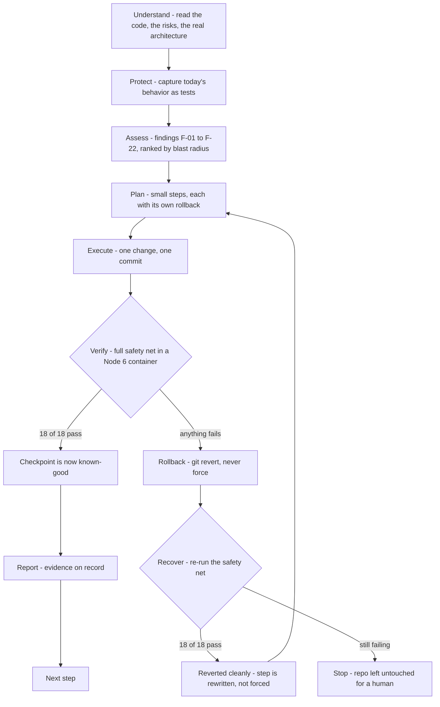
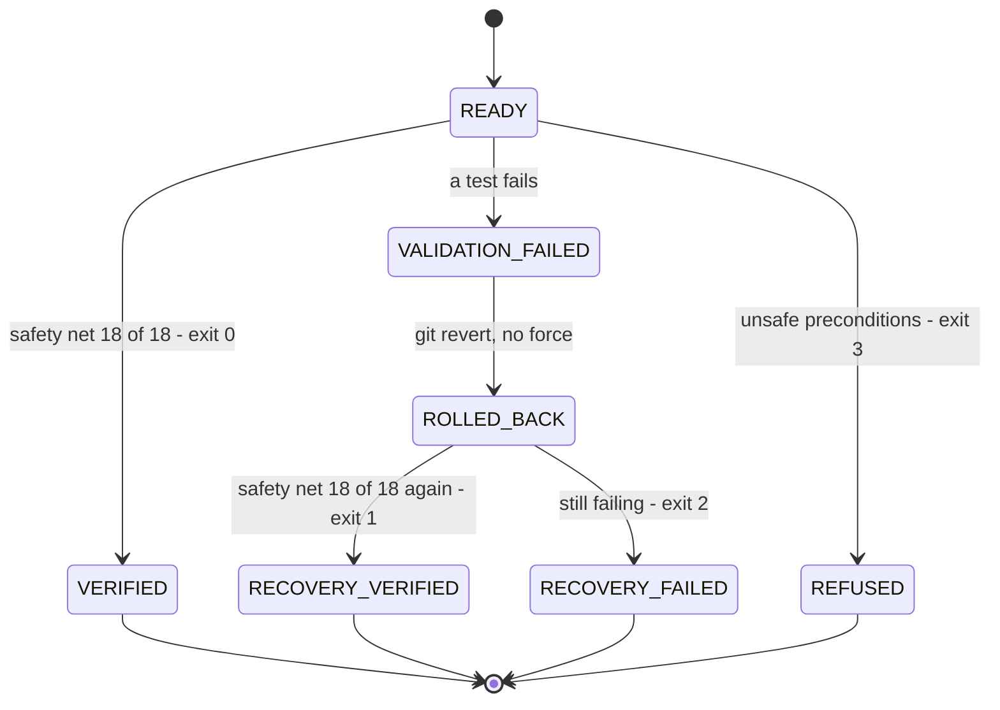

# Legacy Code Whisperer

**Team Codexmatrix — IBM Bob 2.0 Hackathon**

Legacy Code Whisperer modernizes a legacy application **one provably safe step at a time**. It never asks anyone to trust an AI edit: every change is a commit, every commit is measured against a captured behavioral safety net, and a change that regresses anything is reverted automatically.

> We don't ask developers to trust AI with their legacy code. We make every change prove that it is safe.

**Live target:** [Get24](https://github.com/CoryG89/Get24) — a 2013-era multiplayer card game on Node 0.8, Express 3, Socket.IO 0.9 and KineticJS, imported here unmodified and modernized in place.

---

## The problem

AI-assisted modernization fails in a boring, predictable way: the model changes something plausible, the app still starts, and a behavior nobody wrote a test for quietly breaks. There is no signal to stop on.

The fix is not a better prompt. The fix is a **gate**: capture the current behavior first, then let every single change prove it preserved that behavior — with an automatic, non-destructive way back.

## How it works



Each arrow is a gate, not a phase description. The interesting property is the failure path: **a failed verification is a normal, cheap outcome**, because rollback is `git revert` of a single commit — no history rewriting, no force-push, no lost work.

## Quick start

Requires Docker (the legacy runtime is Node 6) and Node 18+ for the tooling. The host's Node is never used to run the legacy app.

```bash
# 1. Run the behavioral safety net (installs the legacy deps in a node:6 container)
node tools/validate.js

# 2. Verify one modernization commit, and roll it back automatically if it regresses
node tools/checkpoint.js 6393892

# 3. Fast safety checks for the orchestrator itself (no Docker needed)
node tools/checkpoint.test.js

# 4. The judge-facing dashboard
cd frontend && npm install && npm run dev
```

`tools/checkpoint.js` is the product in one command: it refuses on unsafe preconditions, runs validation, and on failure delegates to a real revert and re-validates. It prints its state as it goes and writes a JSON record to `validation/last-checkpoint.json`.

### What it refuses to do

A checkpoint run aborts **before touching the repository** if the tree is dirty, the target commit is not in the current history, the commit looks like validation infrastructure rather than a modernization, the baseline safety net does not pass first, or Docker is unavailable. Six of these refusals are covered by `tools/checkpoint.test.js`.

## What is actually implemented

| Phase | Artifact | Evidence |
|---|---|---|
| **Understand** | 22-finding assessment of the imported app, plus a real Mermaid architecture map of client, server and event contract | `ASSESS.md`, dashboard **Architecture** screen |
| **Protect** | 18 behavioral tests captured against the untouched app, run in the app's own Node 6 runtime | `legacy/get24-baseline/tests/`, `96c17e1` |
| **Assess** | Risk review with line-level evidence, re-verified against the source | `ASSESS.md`, `legacy/get24-baseline/analysis/ASSESS-ARATI.md` |
| **Plan** | 7 incremental steps, each with an exact change, a verification command and a rollback condition | `PLAN.md` |
| **Execute → Verify → Rollback → Recover** | `validate.js` → `checkpoint.js` → `rollback.js`, plus their own tests | `tools/`, `validation/README.md` |
| **Report** | Per-run JSON records, chronological session evidence | `validation/`, `bob_sessions/` |

### Verified runs

Every number below is from a real run on this repository, not a target.

| Run | Safety net | Outcome |
|---|---|---|
| Baseline, before any change | 18/18 | known-good |
| `6393892` — F-11, `node-uuid` → `uuid@9.0.1` | 18/18 | `VERIFIED`, exit 0 |
| Deliberate regression: Socket.IO `connected` renamed to `connected2` | 16/18 | detected |
| Same run, automatic rollback | 18/18 | `RECOVERY_VERIFIED`, exit 1 |
| Orchestrator self-tests | 6/6 | refusals hold, no Docker required |

The regression run is in the history on purpose: `8a68cb2` introduces the break, `3ef19ad` reverts it, and the state of the repository is proof rather than a claim.

### The checkpoint state machine



## The protected safety net

The tests were written against the **unmodified** app, so they describe legacy behavior, including its quirks.

| File | Tests | Covers |
|---|---|---|
| `http.test.js` | 4 | static assets, the Socket.IO 0.9 client build, 404s, the favicon |
| `socket.test.js` | 4 | handshake, `connected` with an incrementing user count, `gameJoined` with a uuid v4 room, timer starts |
| `game-events.test.js` | 10 | both players in one game, expression evaluation, all four `invalidExpr` messages, win and loss, disconnect, timer expiry, connection cap |

**Testing seams, not production edits.** The tests use `PORT`, a seeded `Math.random`, an in-memory connection cap and timer, an `xmlhttprequest` shim, and an in-process transport switch. Not one line of the legacy application was modified to make a test pass — the diff that proves it is in the Protect commit.

The reference runtime is pinned: a `node:6` Docker container with a named volume for dependencies, and the resolved dependency tree archived in `legacy/get24-baseline/repro/`.

## Modernization progress

| Step | Change | Findings | Status |
|---|---|---|---|
| 1 | Type guard for `validate()` | F-18 | **done**, `37d3cd7` |
| 2 | `node-uuid` → `uuid@9.0.1` | F-11 | **done**, `6393892` |
| 3 | `node-expression-eval` → `expr-eval` | F-12 | planned |
| 4 | Decouple server start from module load | F-13 | planned |
| 5 | Express 3 → 4 | F-02…F-05, F-10 | planned |
| 6 | Socket.IO 0.9 → 4 | F-06…F-09, F-21 | planned |
| 7 | KineticJS → Konva.js, fix `layer` and `blink` bugs | F-16, F-17, F-20 | planned |

Two of seven steps are complete, both verified by the full safety net. The remaining steps are specified in `PLAN.md` down to the exact edit and the rollback condition; they are not started, and this repository does not claim otherwise.

`ASSESS.md` holds 22 findings. A second, independent review added 6 more (F-23…F-28) in `legacy/get24-baseline/analysis/ASSESS-ARATI.md`, including a missing `public/favicon.ico` that would have broken a test in Step 5.

## Repository layout

```text
index.js  package.json  public/  server/     the imported Get24 app, unmodified except for the two verified steps
ASSESS.md  PLAN.md                             findings and the step-by-step execution plan
tools/
  validate.js          runs the 18 tests in the Node 6 container, writes JSON
  rollback.js          safe git revert of one modernization commit
  checkpoint.js        Execute -> Verify -> Rollback -> Recover orchestrator
  checkpoint.test.js   six refusal tests for the orchestrator
validation/            runner documentation; run records are written here and ignored by git
legacy/get24-baseline/
  tests/               the 18 protected behavioral tests and their harness
  repro/               resolved dependency tree and shrinkwrap of the legacy runtime
  analysis/            independent second-pass assessment and execution specification
frontend/              React dashboard: Architecture, Risk, Plan, Execution, Verify, Rollback, Report
IBM_BOB/               IBM Bob records, and README.md explaining exactly what is real
bob_sessions/          chronological session evidence
```

## IBM Bob and OpenCode

IBM Bob is the tool this project is built around, and `IBM_BOB/` holds the records of its use: `BOB_USAGE.md`, `BOB_CHANGES.md`, `BOB_PROMPTS.md`. Those files were written independently on two branches and are both preserved verbatim, in file order, with a divider where the histories meet — no entry was renumbered or rewritten.

The validation and checkpoint tooling in `tools/` was built with OpenCode, Nidhi's own coding agent, and is labelled as such in `bob_sessions/2026-09-26-execute-verify-rollback.md`. OpenCode work is never recorded as Bob work. `IBM_BOB/README.md` indexes every record, states which tool produced it, and lists what has no evidence yet.

## Honest limitations

- **The dashboard is a front end, not a live product.** The Architecture screen is generated from the real source. The workflow screens ship with illustrative demo content, so their repository and test names are sample data; the counts (18) and every number in this README come from real runs.
- **Get24 is a demo target**, and two of seven modernization steps are done. The point of the submission is the safety loop, not a finished Express 4 port.
- **Rollback is `git revert`**, so history keeps the failed attempt. That is deliberate: the evidence stays visible, and nothing is ever force-pushed.
- **The 18 tests are a safety net, not a specification.** They capture the behavior that existed on import day. Known gaps are listed in `legacy/get24-baseline/analysis/ASSESS-ARATI.md`.
- **Validation needs Docker.** Without it the orchestrator refuses rather than pretending to verify.

## Team

| Member | Role | Focus |
|---|---|---|
| Nidhi | Technical lead | integration, validation and checkpoint tooling, execution plan |
| Arati | Legacy analysis and risk | line-level assessment, KineticJS and Socket.IO upgrade specifications |
| Iffa | Frontend | dashboard, workflow state, architecture visualization |
| Samrudhi | Testing and rollback | behavioral safety net, rollback and recovery verification |

## Upstream

Get24 is © its original authors and is used here under the MIT License (`LICENSE.md`). The application was imported unmodified at `baseline/import-get24`; every change since then is a reviewed, verified commit on top of it.
