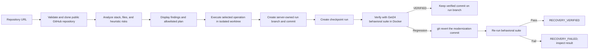
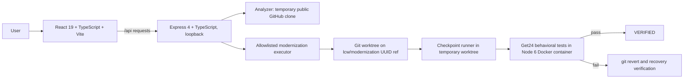

# Legacy Code Whisperer

**Legacy analysis, allowlisted modernization, and checkpoint-based recovery**
Built for the IBM Bob 2.0 Hackathon by Team Codexmatrix.

Legacy Code Whisperer explores a safety-first way to modernize an inherited application: inspect a repository, identify risks, offer a small approved change, and run a behavioral checkpoint before accepting that change. The included target is Get24, a legacy Node.js multiplayer game.

> The analysis API can inspect a public GitHub repository. The current modernization catalogue and checkpoint engine are purpose-built for the Get24 application included in this repository; analysis of an arbitrary URL does not make that URL the executor's target.

## The problem

Legacy code often has undocumented behavior and dependencies that no longer receive support. A change can appear to work while quietly breaking a behavior that users rely on. Teams need a way to understand the code, test a proposed change against a baseline, and recover without rewriting Git history.

## Who this is for

The project is a hackathon prototype for developers and maintainers evaluating small, reviewable changes to legacy applications. Its current executor is a Get24-specific demonstration, not a general-purpose modernization service.

## The solution

The project combines a React workflow UI with a local Express API. Repository analysis is read-only. A server-authored allowlist describes the supported edits. The executor applies one operation in an isolated worktree and creates a commit on a server-owned branch. The checkpoint engine checks commit ancestry, runs the included behavioral tests in the legacy runtime, and uses `git revert` plus revalidation when a regression occurs.

The project does not call a language model at runtime. IBM Bob usage described below is development history, not a runtime dependency.

## Workflow


```mermaid
flowchart LR
  U[Repository URL] --> A[Validate and clone public GitHub repository]
  A --> B[Analyze stack, files, and heuristic risks]
  B --> C[Display findings and allowlisted plan]
  C --> D[Execute selected operation in isolated worktree]
  D --> E[Create server-owned run branch and commit]
  E --> F[Create checkpoint run]
  F --> G[Verify with Get24 behavioral suite in Docker]
  G -->|VERIFIED| H[Keep verified commit on run branch]
  G -->|Regression| I[git revert the modernization commit]
  I --> J[Re-run behavioral suite]
  J -->|Pass| K[RECOVERY_VERIFIED]
  J -->|Fail| L[RECOVERY_FAILED; inspect result]
```

The **repository URL stage analyzes the clone**. The **modernization/checkpoint stage operates on the checked-out Legacy Code Whisperer repository and its included Get24 target**. Do not treat an analysis result for another repository as authorization to modify that repository.

## Architecture


```mermaid
flowchart LR
  User --> UI[React 19 + TypeScript + Vite]
  UI -->|/api requests| API[Express 4 + TypeScript, loopback]
  API --> Analyzer[Analyzer: temporary public GitHub clone]
  API --> Executor[Allowlisted modernization executor]
  Executor --> Worktree[Git worktree on lcw/modernization UUID ref]
  Worktree --> Runner[Checkpoint runner in temporary worktree]
  Runner --> Suite[Get24 behavioral tests in Node 6 Docker container]
  Suite -->|pass| Verified[VERIFIED]
  Suite -->|fail| Revert[git revert and recovery verification]
```

The backend uses Git and Docker for its local workflow. It binds to `127.0.0.1`, has no application authentication, and stores API run records in process memory. No database or deployed API service is configured.

## Frontend

The existing frontend is React 19, TypeScript, and Vite. Its entry point is `frontend/src/main.tsx`; `frontend/src/App.tsx` coordinates the screens and workflow state. Screens cover landing/repository entry, architecture, overview, risk, plan, execution, verification, rollback, and report. Navigation is in-app state rather than URL routing. Styling is hand-written CSS with light/dark themes. Vite proxies `/api` to the local backend in development and preview. Repository entry and API calls expose loading, timeout, malformed-response, and server-error states.

The API client in `frontend/src/api/workflowApi.ts` handles repository analysis, run retrieval, operations, execution, and checkpoint lifecycle requests. Some overview/report/workflow presentation still uses mock data. Mock data is illustrative and is not evidence that an API operation or test ran; live API results are used for the real analysis and checkpoint interactions.

## Backend and API

The backend is Node.js, Express 4, and TypeScript. `backend/src/index.ts` starts the API; `backend/src/app.ts` configures JSON parsing, CORS, routes, and error envelopes. The API binds to `127.0.0.1:3001` by default.

| Method | Route | Purpose and input | Result |
|---|---|---|---|
| `GET` | `/api/health` | Local API health | Success envelope |
| `POST` | `/api/analyze` | `{ "repoUrl": "https://github.com/owner/repo" }` | Analysis run ID and workflow |
| `GET` | `/api/runs/:runId` | Retrieve a server-held analysis run | Run ID and workflow, or error |
| `GET` | `/api/modernization/operations` | List server-authored operations | Operation summaries |
| `POST` | `/api/modernization/execute` | `{ "analysisRunId": "…", "operationId": "…" }` | Updated workflow and commit details |
| `POST` | `/api/checkpoint-runs` | `{ "analysisRunId": "…" }` | New checkpoint-run view |
| `POST` | `/api/checkpoint-runs/:id/verify` | Verify the server-resolved checkpoint subject | Checkpoint-run view/status |
| `GET` | `/api/checkpoint-runs/:id` | Retrieve checkpoint-run state | Checkpoint-run view/status |

The API uses JSON envelopes and structured errors. There is no formal OpenAPI specification. Analysis only accepts public GitHub HTTPS repository URLs; it does not run scripts or install dependencies from the analyzed clone.

## Modernization, checkpoint, and recovery

`backend/src/modernization/operations.ts` is the server-side operation catalogue. Operations supply their own file paths and exact source/replacement text; the client sends only the operation ID and analysis run ID. The executor plans all edits before writing and refuses missing/ambiguous matches or protected paths.

```mermaid
sequenceDiagram
  participant UI as React UI
  participant API as Express API
  participant Git as Local Git repository
  participant Engine as Checkpoint engine
  participant Tests as Docker legacy suite
  UI->>API: execute(analysisRunId, operationId)
  API->>Git: create worktree from main; create server-owned run ref
  Git-->>API: modernization commit
  UI->>API: create checkpoint, then verify(checkpointRunId)
  API->>Engine: resolve commit and trusted run ref server-side
  Engine->>Git: verify full SHA ancestry; create temporary worktree
  Engine->>Tests: run behavioral tests
  Tests-->>Engine: pass or regression
  alt Tests pass
    Engine-->>API: VERIFIED
  else Tests fail
    Engine->>Git: git revert modernization commit
    Engine->>Tests: re-run behavioral tests
    Tests-->>Engine: recovery result
    Engine-->>API: RECOVERY_VERIFIED or RECOVERY_FAILED
  end
```

The current operation catalogue is deliberately small and tied to Get24. Analysis of another repository does not change the executor base or its operation target. A checkpoint run uses server-owned state and refs; the browser cannot submit a commit SHA, branch, path, or shell command as its subject.

## Safety model

- **Allowlisted, exact-match edits:** only reviewed server-side transformations are available. A source string must match exactly once; ambiguous, missing, duplicate-target, or unsupported edits are refused.
- **Protected paths and root containment:** modernization cannot edit the test/validation control plane or escape its worktree root.
- **Input/ref checks:** request fields are validated; checkpoint subjects require a full commit SHA, a named trusted ref, and Git ancestry containment.
- **Isolation:** execution and verification use Git worktrees. Child processes use argument arrays rather than shell strings and have time bounds.
- **Analysis limits:** scan reads are limited to 4 MiB per file and 2,000 code files for the LOC estimate; selected scans also cap files inspected. Clone has a 60-second timeout. The clone has no total byte/repository-size cap.
- **Cleanup and recovery:** temporary worktrees are removed with cleanup failures surfaced. Regression recovery creates a revert commit and reruns validation; history is not reset or force-pushed.
- **Local-only trust boundary:** the API binds to loopback but has no authentication. Do not expose it as a shared or public service without adding an appropriate access-control design.

Run and checkpoint API records are in memory and are lost on backend restart. The modernization commit and revert commit remain on the server-owned Git run branch; there is no general run-branch retention/cleanup policy.

## IBM Bob 2.0 evidence

The evidence index at [IBM_BOB/README.md](IBM_BOB/README.md) records which work is attributed to IBM Bob and which was produced with OpenCode. Full usage, change, and prompt logs remain in `IBM_BOB/`; dated session records and their index remain in `bob_sessions/`. The repository contains analysis and planning artifacts referenced by those records.

The records report IBM Bob IDE use for Arati's legacy risk analysis and modernization execution planning. They identify other implementation work as OpenCode. There are no Bob screenshots, transcripts, chat logs, or exported sessions in the repository. Historical attribution errors are preserved and explained in the evidence index; this README does not claim unsupported Bob contributions.

## Project structure

```text
frontend/                         React/Vite workflow UI and contract test
backend/src/                      Express API, analyzer, executor, checkpoint runner
backend/test/                     API, trust-boundary, executor, and security tests
tools/                            Legacy validation, rollback, checkpoint scripts/tests
legacy/get24-baseline/            Imported Get24 analysis, tests, and runtime snapshot
validation/                       Runner documentation and ignored runtime results
IBM_BOB/                          Bob usage, change, prompt, and provenance records
bob_sessions/                     Dated session summaries and evidence index
ASSESS.md                         Legacy code assessment
PLAN.md                           Modernization plan and historical implementation plan
LICENSE                           Legacy Code Whisperer project MIT license
LICENSE.md                        Upstream Get24 MIT license text
```

## Technology

- **Frontend:** React 19, TypeScript, Vite, Mermaid, CSS, oxlint
- **API:** Node.js, Express 4, TypeScript, CORS, UUID
- **Verification:** Node test runner, Git, Docker, Node 6 legacy container
- **Package manager:** npm in the frontend and backend; the legacy Get24 app retains its own historical package metadata and archived dependency snapshot.

## Getting started

Use Node.js 20.19 or newer (or 22.12 or newer) for the frontend tooling; Docker is needed for the legacy behavioral checkpoint. Start the backend and frontend in separate terminals from the repository root:

```powershell
# Terminal 1: API at http://127.0.0.1:3001
cd backend
npm ci
npm run dev
```

```powershell
# Terminal 2: UI at http://localhost:5173
cd frontend
npm ci
npm run dev
```

No environment file is required for the documented local setup. The API port can be changed with `PORT`. Enter a public GitHub HTTPS URL for analysis. The modernization/checkpoint path is scoped to the local Legacy Code Whisperer/Get24 checkout and requires its Git refs and Docker environment.

## Testing and verification

Available checks:

```powershell
Push-Location backend; npm test; Pop-Location
Push-Location frontend; npm test; npm run build; npm run lint; Pop-Location
node tools/checkpoint.test.js
node tools/validate.js
```

`backend npm test` includes the TypeScript build. `frontend npm run build` performs the TypeScript project build and Vite production build. The checkpoint refusal tests do not need Docker; `tools/validate.js` needs Docker and runs the legacy behavioral suite. Historical Bob/session/validation records describe the commits they identify and are not current-checkout test results.

### Finalization verification

Run against the application code at `c0760c7`; this release pass changes documentation only.

| Check | Result |
|---|---|
| Backend build and tests (`backend/npm test`) | Passed: 234 tests, 0 failed |
| Frontend contract tests (`frontend/npm test`) | Passed: 16 tests, 0 failed |
| Frontend TypeScript and production build | Passed; Vite reports a large-chunk warning for the Mermaid bundle |
| Frontend lint (`frontend/npm run lint`) | Passed with two warnings: Fast Refresh export pattern and a state update inside an effect |
| Legacy Docker behavioral suite (`node tools/validate.js`) | Passed: 18 tests, 0 failed |
| Tracked credential check | Passed as part of backend tests; no credential material reported as tracked |
| Browser smoke test | Not run because no browser session was available |

The standalone checkpoint refusal self-test is run from a clean worktree because it explicitly checks dirty-tree refusal. Its final result is recorded after the release commit.

## Limitations and deployment

- The analyzer uses heuristic static checks, not a language model or deep semantic analysis.
- The analysis clone is not connected as the executor's mutation target; the current executor is tailored to the included Get24 files.
- The frontend includes illustrative mock presentation data; not every screen is a persisted server view.
- The API run store is process-local and unauthenticated. It is bound to loopback for local development.
- Repository cloning has a timeout but no total size cap; checkpoints require local Git and Docker.
- No deployment configuration is included. The full workflow is documented for local use; no hosted service or production deployment is claimed.
- No browser smoke-test result is claimed by this README. See the release report for the result of this finalization pass.

## License

The Legacy Code Whisperer project code is licensed under the [MIT License](LICENSE). The included upstream Get24 application retains its original MIT license text and 2013 Cory Gross notice in [LICENSE.md](LICENSE.md). The upstream license is kept separate from the project license.

## Repository and evidence links

- [Source repository](https://github.com/the-nidhi-bhat/Codexmatrix-IBM-Bob-Hackathon)
- [IBM Bob evidence index](IBM_BOB/README.md)
- [Bob session index](bob_sessions/INDEX.md)
- [Assessment](ASSESS.md) · [Modernization plan](PLAN.md) · [Validation documentation](validation/README.md)
