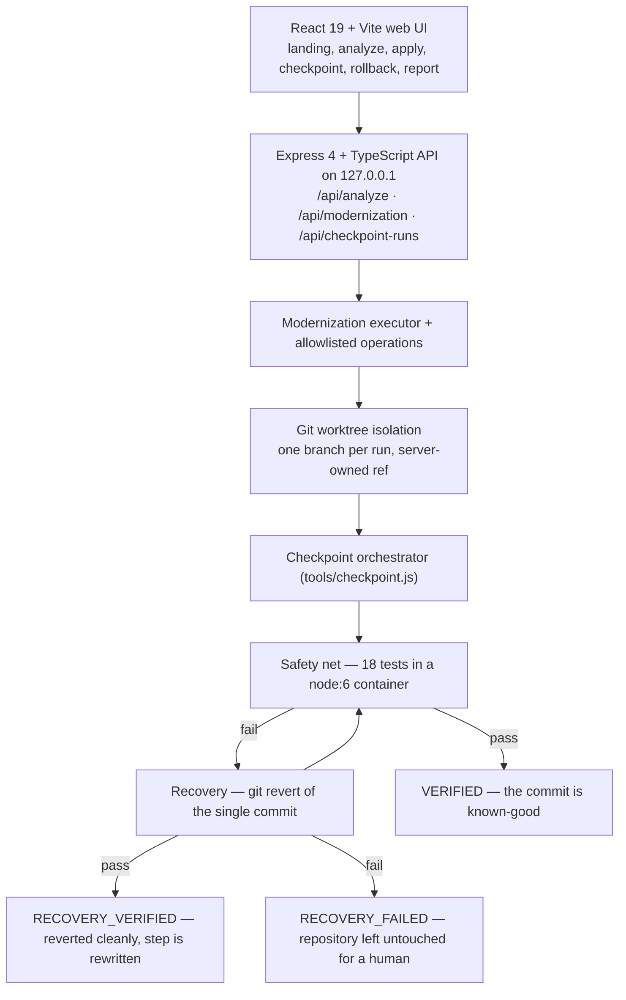

# ForgeFlow

**Team Codexmatrix — IBM Bob 2.0 Hackathon**

ForgeFlow modernizes a legacy application **one provably safe step at a time**. It never asks anyone to trust an automated edit: every change is a commit, every commit is measured against a behavioral safety net captured from the *unmodified* application, and a change that regresses anything is reverted automatically.

> We do not ask developers to trust automation with their legacy code. We make every change prove that it is safe.

**Project Links**

| | |
|---|---|
| Live demo | https://forgeflow-ecru.vercel.app |
| Demo video | https://youtu.be/cjVYj87INMo |
| Submission write-up | [presentation/IBM_Bob_Hackathon_Submission.md](presentation/IBM_Bob_Hackathon_Submission.md) *(see note below)* |
| IBM Bob evidence | [bob_sessions/](bob_sessions/) · [IBM_BOB/](IBM_BOB/) |
| Architecture & plan | [ASSESS.md](ASSESS.md) · [PLAN.md](PLAN.md) |
| Runner documentation | [validation/README.md](validation/README.md) |

*Note: the submission write-up and the slide/PDF bundle referenced by the demo video are maintained outside this repository; the authoritative in-repo record is `ASSESS.md`, `PLAN.md`, `IBM_BOB/` and `bob_sessions/`. The in-app product name is still "Legacy Code Whisperer" — the same project, renamed for the submission.*

**Demonstration target:** [Get24](https://github.com/CoryG89/Get24) — a 2013-era multiplayer card game on Node 0.8, Express 3, Socket.IO 0.9 and KineticJS, imported here unmodified and modernized in place.

---

## The problem

Automated modernization fails in a boring, predictable way: the tool changes something plausible, the app still starts, and a behavior nobody wrote a test for quietly breaks. There is no signal to stop on, and no cheap way back.

The fix is not a better prompt. The fix is a **gate**: capture the current behavior first, then let every single change prove it preserved that behavior — with an automatic, non-destructive way back.

## Key Features

Every item below is implemented in this repository and covered by a test or a recorded run.

- **Legacy repository ingestion** — analyzes a public GitHub repository by cloning it into an isolated worktree.
- **Server-owned run references** — the API issues the run and branch reference (`lcw/modernization/…`); the client never supplies one.
- **Analysis** — a real static analysis pass over the cloned tree: dependencies, entry points, framework and runtime signals, with file-level findings.
- **Risk and architecture insight** — findings ranked by blast radius, plus a generated architecture map of the analyzed system.
- **Allowlisted modernization operations** — only pre-approved transformations are offered (e.g. `node-expression-eval` → `expr-eval`, `node-uuid` → `uuid`); nothing is invented at apply time.
- **Isolated execution** — every applied change is made in a dedicated `git` worktree on its own branch, and committed there.
- **Ancestry validation** — a checkpoint refuses to run unless the target commit is genuinely in the current history of the worktree.
- **Behavioral safety net** — 18 tests captured against the untouched application, executed in the application's own runtime (a `node:6` Docker container), never on the host.
- **Checkpoint verification** — one command creates the checkpoint, runs the safety net, and reports `VERIFIED`, `VALIDATION_FAILED`, `REFUSED`, `RECOVERY_VERIFIED` or `RECOVERY_FAILED`.
- **Recovery / rollback** — on failure the change is undone with `git revert` (never `reset --hard`, never a force-push) and the safety net is re-run to prove the repository is clean.
- **Web interface** — a React workflow that exposes every step, its state and its evidence, ending in a report.
- **Light and dark themes** — token-driven, no flash on first paint, keyboard accessible toggle.

## Why It Matters

ForgeFlow treats modernization as a controlled, observable and recoverable operation instead of an irreversible one. The value is not "the model wrote better code" — it is that there is a mechanical answer to the only question that matters during a risky change: *did this break anything, and can I get back?*

## Architecture


```mermaid
graph TD
  UI["React 19 + Vite web UI<br/>landing, analyze, apply, checkpoint, rollback, report"]
  API["Express 4 + TypeScript API on 127.0.0.1<br/>/api/analyze · /api/modernization · /api/checkpoint-runs"]
  WF["Modernization executor + allowlisted operations"]
  ISO["Git worktree isolation<br/>one branch per run, server-owned ref"]
  CHK["Checkpoint orchestrator (tools/checkpoint.js)"]
  VAL["Safety net — 18 tests in a node:6 container"]
  RB["Recovery — git revert of the single commit"]
  UI --> API --> WF --> ISO --> CHK --> VAL
  VAL -->|pass| OK["VERIFIED — the commit is known-good"]
  VAL -->|fail| RB --> VAL
  RB -->|pass| REC["RECOVERY_VERIFIED — reverted cleanly, step is rewritten"]
  RB -->|fail| STOP["RECOVERY_FAILED — repository left untouched for a human"]
```

The API is deliberately loopback-only and the analyzer refuses oversized and symlinked trees; the trust boundary and its refusals are covered by tests.

## Workflow

1. **Landing → Analyze a repository** — enter a public GitHub URL.
2. **Overview / Architecture / Risk** — the analysis result: structure, architecture map and ranked findings.
3. **Plan** — the allowlisted modernization operations, each with the finding it addresses.
4. **Execution** — *Apply* one operation. The API clones the repository into a fresh worktree, applies the single change and commits it.
5. **Verification** — *Run checkpoint*. The safety net runs in the container against that commit.
6. **Result** — `VERIFIED` (the commit is known-good) or a failure with the failing test named.
7. **Rollback** — *Recover* reverts the commit with `git revert` and re-verifies, so the failure path is as cheap as the success path.
8. **Report** — the run record: commit, branch, safety-net output, verdict.

## Tech Stack

**Frontend** — React 19, TypeScript, Vite, Mermaid (architecture diagram), hand-written token-driven CSS with light/dark themes, `oxlint`.

**Backend** — Node.js, Express 4, TypeScript, `cors`, `uuid`. Binds to `127.0.0.1` only. No database: run state is an in-memory store scoped to the process.

**AI / automation** — IBM Bob 2.0 as the development workflow (see below). At runtime the modernization is *deterministic*: a static analyzer plus an allowlist of code transformations. There is no model call in the request path, which is what makes a verdict reproducible.

**Git / version control** — `git worktree` for isolation, `git revert` for recovery, ancestry validation before any verdict. Nothing is ever force-pushed and history is never rewritten.

**Testing** — `node:test` for the backend (234 tests) and the API contract tests (16), `tools/checkpoint.test.js` (6 refusal tests) for the orchestrator, and the 18-test legacy safety net executed in Docker.

**Deployment** — the web UI is deployable as a static build (Vite output in `frontend/dist`). The API and the checkpoint engine run locally, because the engine needs Docker and a real `git` worktree.

## Quick start

Requires Docker (the legacy runtime is Node 6) and Node 18+ for the tooling. The host's Node is never used to run the legacy application.

```bash
# 1. Run the behavioral safety net (installs the legacy dependencies in a node:6 container)
node tools/validate.js

# 2. Verify one modernization commit; it rolls back automatically if the commit regresses
node tools/checkpoint.js <commit-sha>

# 3. Fast safety checks for the orchestrator itself (no Docker required)
node tools/checkpoint.test.js

# 4. The web workflow
cd backend  && npm install && npm run build && npm start   # API on 127.0.0.1:3001
cd frontend && npm install && npm run build && npm run preview   # UI on http://localhost:4173
```

`tools/checkpoint.js` is the product in one command: it refuses on unsafe preconditions, runs validation, and on failure delegates to a real revert and re-validates. It prints its state as it goes and writes a JSON record to `validation/last-checkpoint.json`.

### What it refuses to do

A checkpoint aborts **before touching the repository** if the worktree is dirty, the target commit is not in the current history, the commit looks like validation infrastructure rather than a modernization, the baseline safety net does not pass first, or Docker is unavailable. Six of these refusals are covered by `tools/checkpoint.test.js`.

## Verified runs

Every number below comes from a real run on this repository, not from a target.


## The protected safety net

The tests were written against the **unmodified** application, so they describe legacy behavior including its quirks.

| File | Tests | Covers |
|---|---|---|
| `http.test.js` | 4 | static assets, the Socket.IO 0.9 client build, 404s, the favicon |
| `socket.test.js` | 4 | handshake, `connected` with an incrementing user count, `gameJoined` with a uuid v4 room, timer start |
| `game-events.test.js` | 10 | two players in one game, expression evaluation, the `invalidExpr` messages, win and loss, disconnect, timer expiry, connection cap |

**Testing seams, not production edits.** The tests use `PORT`, a seeded `Math.random`, an in-memory connection cap and timer, an `xmlhttprequest` shim and an in-process transport switch. No line of the legacy application was modified to make a test pass.

The reference runtime is pinned: a `node:6` Docker container, with the resolved dependency tree archived under `legacy/get24-baseline/repro/`.

## IBM Bob 2.0 Usage

IBM Bob was used as part of the development workflow of this project, and its use is recorded rather than asserted.

**What the evidence shows.** The Bob records in [`IBM_BOB/`](IBM_BOB/) and the session records in [`bob_sessions/`](bob_sessions/) document work in these areas:

- **Repository and codebase analysis** — reading the imported legacy application to establish its real structure and runtime behavior before changing anything (`ASSESS.md`, `legacy/get24-baseline/analysis/ASSESS-ARATI.md`).
- **Planning** — turning that analysis into a step-by-step execution plan where every step names its change, its verification command and its rollback condition (`PLAN.md`).
- **Implementation assistance** — the validation runner, the rollback tool and the checkpoint orchestrator in `tools/`, together with the API that exposes them (`backend/src/routes/checkpoint.ts`).
- **Testing and verification** — the 18-test behavioral safety net, the orchestrator refusal tests, and the backend and frontend test suites that guard the API contract.
- **Development workflow support** — chronological session records kept in `bob_sessions/`.

### Bob Evidence

[`bob_sessions/`](bob_sessions/) holds the preserved Bob development evidence for this project: dated session records for the execution plan, the validation runner, the execute/verify/rollback milestone and the rollback/recovery milestone, plus a [README](bob_sessions/README.md) and an [index](bob_sessions/INDEX.md) mapping each record to the development area it covers. [`IBM_BOB/`](IBM_BOB/) holds the longer-running Bob usage log, the change log and the prompt log; its own [README](IBM_BOB/README.md) states which tool produced each record.

Two rules govern these records: no entry is edited after the fact, and work performed by other tools is never recorded as Bob work. Where a record covers tooling built with OpenCode, it says so in the record itself.

## Repository layout

```text
index.js  package.json  public/  server/   the imported Get24 application, unmodified except for verified steps
ASSESS.md  PLAN.md                     findings and the step-by-step execution plan
tools/
  validate.js          runs the 18 tests in the Node 6 container, writes JSON
  rollback.js          safe `git revert` of one modernization commit
  checkpoint.js        Execute → Verify → Rollback → Recover orchestrator
  checkpoint.test.js   refusal tests for the orchestrator
backend/               Express + TypeScript API: analysis, modernization, checkpoint runs
  src/routes/          analyze, modernization, checkpoint-runs
  src/modernization/   allowlisted operations and the executor
  src/checkpointRunner.ts
frontend/              React workflow: Landing, Start, Architecture, Overview, Risk, Plan,
                       Execution, Verification, Rollback, Report
validation/            runner documentation; run records are written here and ignored by git
legacy/get24-baseline/
  tests/               the 18 protected behavioral tests and their harness
  repro/               resolved dependency tree and shrinkwrap of the legacy runtime
  analysis/            independent second-pass assessment and execution specification
IBM_BOB/               Bob records, with a README stating exactly what is real
bob_sessions/          chronological Bob session evidence
```

## Modernization progress

| Step | Change | Findings | Status |
|---|---|---|---|
| 1 | Type guard for `validate()` | F-18 | done, `37d3cd7` |
| 2 | `node-uuid` → `uuid@9.0.1` | F-11 | done, `6393892` |
| 3 | `node-expression-eval` → `expr-eval` | F-12 | specified in `PLAN.md`; the operation is available in the UI |
| 4 | Decouple server start from module load | F-13 | specified |
| 5 | Express 3 → 4 | F-02…F-05, F-10 | specified |
| 6 | Socket.IO 0.9 → 4 | F-06…F-09, F-21 | specified |
| 7 | KineticJS → Konva.js, fix `layer` and `blink` bugs | F-16, F-17, F-20 | specified |

Two of seven steps are committed and verified in this repository. The remaining steps are specified in `PLAN.md` down to the exact edit and the rollback condition; they are not started here, and this repository does not claim otherwise.

`ASSESS.md` holds 22 findings. An independent second review added 6 more (F-23…F-28) in `legacy/get24-baseline/analysis/ASSESS-ARATI.md`.

## Honest limitations

- **The checkpoint engine needs Docker.** Without it the orchestrator refuses rather than pretending to verify.
- **The safety net is 18 tests, not a specification.** It captures the behavior that existed on import day; known gaps are listed in `legacy/get24-baseline/analysis/ASSESS-ARATI.md`.
- **Rollback is `git revert`**, so history keeps the failed attempt. That is deliberate: the evidence stays visible and nothing is ever force-pushed.
- **Get24 is a demonstration target**, and two of seven modernization steps are committed here. The submission is the safety loop, not a finished Express 4 port.
- **Run state is in memory.** Restarting the API loses run history; the durable record is the JSON written under `validation/`.
- **The hosted demo is the web UI.** The analysis, apply and checkpoint steps need the local API and Docker, as described in Quick start. No claim is made about which commit the hosted deployment was built from.

## Team

| Member | Role | Focus |
|---|---|---|
| Nidhi | Technical lead | integration, validation and checkpoint tooling, execution plan |
| Arati | Legacy analysis and risk | line-level assessment, KineticJS and Socket.IO upgrade specifications |
| Iffa | Frontend | interface, design system, workflow state, architecture visualization |
| Samrudhi | Testing and rollback | behavioral safety net, rollback and recovery verification |

## License and upstream

ForgeFlow's own code is MIT licensed — see [LICENSE](LICENSE).

The imported Get24 application is © its original authors and is used under the MIT License; that license is preserved verbatim in [LICENSE.md](LICENSE.md) and must not be removed. Get24 was imported unmodified at `baseline/import-get24`; every change since then is a reviewed, verified commit on top of it.
