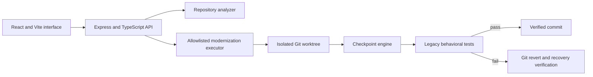

# Legacy Code Whisperer

**Intelligent Legacy Code Modernization & Recovery**

Built for the **IBM Bob 2.0 Hackathon** by Team Codexmatrix.

Developers maintaining inherited or long-lived repositories can face unfamiliar dependencies, undocumented behavior, and risk when changing code. Legacy Code Whisperer combines repository analysis, a bounded modernization workflow, and a checkpoint/recovery engine so changes can be inspected and tested before they are accepted.

## Workflow

```text
Repository entry → Analysis → Risk and plan → Modernization → Checkpoint
      → Verification → Recovery / rollback
```

The backend accepts a public GitHub repository URL, analyzes a bounded local clone, and creates a server-owned run reference. Modernization choices come from an allowlisted operation catalogue. The executor works in an isolated Git worktree; checkpoint verification checks the selected commit against the legacy behavioral suite, and recovery uses a Git revert followed by verification. The React interface presents the workflow and its results.

For the checked-out project, modernization runs use `main` as the read-only base and apply changes on server-owned run branches.

## What is implemented

- Repository analysis for dependencies, entry points, runtime/framework signals, and file-level findings, with limits and path/symlink protections.
- Risk and architecture views based on the analysis results.
- An allowlisted set of modernization operations, applied in an isolated worktree on a server-owned branch.
- Checkpoint and verification routes that validate run references and commit ancestry before running the checkpoint engine.
- A protected behavioral safety net for the imported Get24 application and a recovery path that preserves Git history.
- A web interface for repository entry, analysis, planning, execution, verification, recovery, and reporting.

The interface also contains mock workflow data for presentation. Mock data is not evidence that a repository operation ran; live analysis and checkpoint results come from the backend and its tools.

## Architecture


```mermaid
flowchart LR
  UI[React and Vite interface] --> API[Express and TypeScript API]
  API --> A[Repository analyzer]
  API --> E[Allowlisted modernization executor]
  E --> W[Isolated Git worktree]
  W --> C[Checkpoint engine]
  C --> V[Legacy behavioral tests]
  V -->|pass| OK[Verified commit]
  V -->|fail| R[Git revert and recovery verification]
```

The API binds to loopback. Run state is held in memory for the life of the backend process. The legacy verification path uses Docker to run the target application in its reference runtime.

The frontend calls `POST /api/analyze` and `GET /api/runs/:runId` for repository analysis; `GET /api/modernization/operations` and `POST /api/modernization/execute` for modernization; and `POST /api/checkpoint-runs`, `POST /api/checkpoint-runs/:id/verify`, and `GET /api/checkpoint-runs/:id` for checkpoint lifecycle operations. The backend uses Git and Docker; no model API is called at runtime.

## Technology

- **Interface:** React, TypeScript, Vite, Mermaid, and oxlint.
- **API:** Node.js, Express, TypeScript, CORS, and UUID.
- **Execution and recovery:** Git worktrees, allowlisted transformations, Docker-based legacy validation, and `git revert`.
- **Legacy demonstration target:** Get24, with its original Node.js, Express, Socket.IO, and KineticJS dependencies preserved in the imported application. See the original dependency declarations in [package.json](package.json) and its [archived dependency snapshot](legacy/get24-baseline/repro/LEGACY_NPM_LS.txt).

## Run locally

Use two terminals from the repository root. The backend listens on `127.0.0.1:3001`; Vite serves the interface on `http://localhost:5173` and proxies `/api` requests to the backend.

```powershell
# Terminal 1
cd backend
npm ci
npm run dev
```

```powershell
# Terminal 2
cd frontend
npm ci
npm run dev
```

Repository analysis needs access to the public GitHub repository entered in the UI. Checkpoint verification needs Docker for the legacy Node.js runtime.

## Verification

The repository includes backend tests for API trust boundaries, checkpoint flow, executor lifecycle and safety, integration wiring, reference validation, static security checks, and validation tooling. It also includes a frontend checkpoint contract test, checkpoint refusal tests, and the legacy behavioral test suite.

Latest recorded local verification for source commit `5d3a193`:

| Check | Result |
|---|---|
| Backend tests | 234 passed, 0 failed |
| Frontend contract tests | 16 passed, 0 failed |
| Checkpoint refusal tests | 6 passed, 0 failed |
| Legacy Docker safety net | 18 passed, 0 failed |
| Frontend typecheck and production build | Passed; build reported a large-chunk warning |
| Lint | Passed with two warnings |

The backend test suite includes the tracked-credential check. The README-only commits after `5d3a193` did not change application code.

Run the existing checks from the repository root:

```powershell
Push-Location backend; npm test; Pop-Location
Push-Location frontend; npm test; npm run build; npm run lint; Pop-Location
node tools/checkpoint.test.js
node tools/validate.js
```

The legacy suite requires Docker. Historical verification records are in [IBM_BOB/](IBM_BOB/), [bob_sessions/](bob_sessions/), and [validation/README.md](validation/README.md); results in those records describe the runs and commits they identify, not necessarily the current checkout.

## IBM Bob evidence

IBM Bob 2.0 was used for documented legacy analysis and modernization planning. The evidence index in [IBM_BOB/README.md](IBM_BOB/README.md) identifies which records are attributed to IBM Bob and which were produced with OpenCode. The session summaries and longer usage, prompt, and change logs are preserved in [bob_sessions/](bob_sessions/) and [IBM_BOB/](IBM_BOB/).

There are no Bob screenshots, transcripts, or exported sessions in this repository. The records explicitly identify attribution errors in some historical session headers; those files remain preserved, with the correction explained in the evidence index. No unsupported Bob contribution is claimed here.

## Repository guide

| Path | Contents |
|---|---|
| `frontend/` | React workflow interface and its contract test |
| `backend/` | API, analyzer, modernization executor, checkpoint routes, and tests |
| `tools/` | Legacy validation, rollback, and checkpoint command-line tools |
| `legacy/get24-baseline/` | Imported application analysis, dependency snapshot, and behavioral tests |
| `validation/` | Validation/checkpoint tool documentation and ignored runtime results |
| `IBM_BOB/`, `bob_sessions/` | IBM Bob and other tool provenance records |
| `ASSESS.md`, `PLAN.md` | Legacy code assessment and modernization plan |

## Project links

- GitHub repository: [Codexmatrix-IBM-Bob-Hackathon](https://github.com/the-nidhi-bhat/Codexmatrix-IBM-Bob-Hackathon)
- Assessment: [ASSESS.md](ASSESS.md)
- Modernization plan: [PLAN.md](PLAN.md)
- Validation and recovery tools: [validation/README.md](validation/README.md)

Presentation and video references mentioned in historical materials are maintained outside this repository and are not presented here as included submission files.

## Deployment

This repository contains no deployment configuration. The API binds to loopback, and checkpoint verification depends on local Git worktrees and Docker, so the documented workflow runs locally.

## License

The Legacy Code Whisperer project code is licensed under the MIT License in [LICENSE](LICENSE). The imported Get24 code retains its original MIT notice in [LICENSE.md](LICENSE.md).
